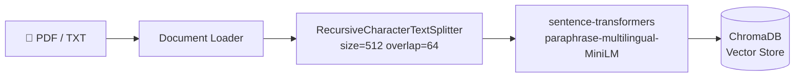
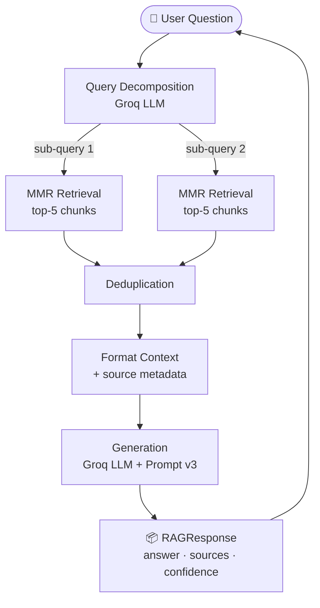
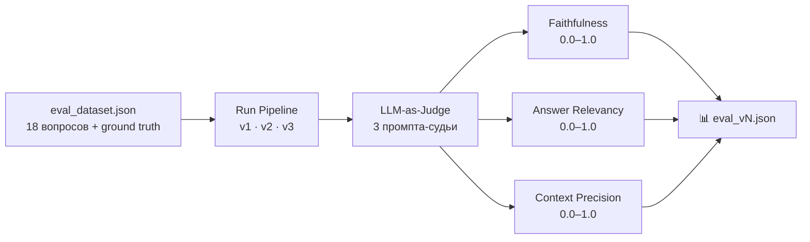

# 🏦 RAG Assistant — финансовый ассистент на основе базы знаний

## Задача

Бизнес-задача: дать клиентам и операторам банка инструмент, который отвечает на вопросы по финансовым продуктам, тарифам и регуляторным документам — точно, с источником, без галлюцинаций.

Технический вызов: обычный LLM не знает внутренних документов, а файн-тюнинг дорог и не масштабируется при частом обновлении базы знаний. RAG решает оба ограничения.

---

## System Diagram

### Ingestion Pipeline (одноразово, при загрузке документов)



### Query Pipeline (каждый запрос пользователя)



### Evaluation Pipeline



---

## Стек

```
Python 3.11+
├── langchain / langchain-chroma       # оркестрация RAG-пайплайна
├── langchain-groq                     # Groq LLM
├── langchain-huggingface              # sentence-transformers embeddings
├── chromadb                           # векторное хранилище
├── pydantic v2                        # валидация structured output
├── typer                              # CLI-интерфейс
└── pytest                             # тесты (14 штук, все проходят)
```

Поддерживаемые LLM провайдеры (переключаются через `.env`): Groq, OpenAI, Anthropic.

---

## Почему такие решения

**Chunk size = 512, overlap = 64**

При меньших чанках (256) retrieval находил точные совпадения, но ответы получались неполными — модель не видела окружающего контекста. При больших чанках (1024) в контекст попадало слишком много нерелевантного текста, что снижало точность генерации. 512 оказался компромиссом между полнотой и точностью. Overlap 64 нужен чтобы сохранить смысл предложений на границах чанков — без него факты, разбитые на стыке двух чанков, терялись.

**MMR вместо простого top-K**

При cosine similarity top-5 несколько возвращаемых чанков оказывались почти идентичными — разные части одного абзаца о тарифах. Модель видела одно и то же с небольшими вариациями, что не добавляло информации. MMR (Maximum Marginal Relevance) балансирует между релевантностью и разнообразием: каждый следующий чанк должен быть одновременно близким к запросу и непохожим на уже выбранные.

**Query Decomposition**

При тестировании составных вопросов ("Какие документы нужны для ИП и сколько стоит открытие счёта?") retrieval стабильно возвращал чанки только по одной части вопроса. Причина: embedding составного вопроса усредняет оба смысла и плохо совпадает с чанками, каждый из которых отвечает только на одну часть. Решение — разбить вопрос на под-запросы и сделать retrieval для каждого.

**ChromaDB вместо Qdrant**

Для локального проекта нет необходимости поднимать отдельный сервис. ChromaDB запускается встроенно в приложение, хранит данные локально и не требует Docker или сетевых подключений. Qdrant был бы оправдан при масштабировании на сотни тысяч документов или при необходимости горизонтального масштабирования.

**Локальные embeddings (sentence-transformers)**

Убирают стоимость генерации эмбеддингов и внешнюю зависимость. Модель `paraphrase-multilingual-MiniLM-L12-v2` хорошо работает с русским языком и запускается на CPU без GPU. Компромисс: качество эмбеддингов ниже чем у `text-embedding-3-small` от OpenAI, но для финансовых документов с однозначной терминологией разницы на практике почти нет.

**Собственный LLM-as-judge вместо RAGAS**

RAGAS — стандартный инструмент, но его зависимости конфликтовали с текущей версией langchain-community. Вместо костылей реализован собственный evaluator по той же методологии: три отдельных промпта-судьи (faithfulness, answer relevancy, context precision), каждый возвращает оценку 0.0–1.0. Это прозрачнее — каждую метрику можно открыть и объяснить построчно.

---

## Как работал Prompt Engineering

### v1 — Baseline

Наивный промпт: передаём контекст и просим ответить. Никаких ограничений.

При проверке ответов обнаружилось, что модель регулярно дополняла ответ фактами из pre-training — например, называла несуществующие тарифы или добавляла условия, которых не было в документе. Формат ответа был непредсказуемым: иногда список, иногда абзац, иногда просто число без единиц.

### v2 — Grounding + Negative Constraint

Наблюдение из v1: модель не знает, что ей нельзя выходить за пределы контекста — она просто старается дать полезный ответ.

Добавлено явное ограничение: *"Если ответа нет в предоставленных фрагментах — скажи об этом"*. Добавлено требование указывать источник для каждого факта.

Оставшаяся проблема: при нескольких retrieved чанках модель иногда смешивала информацию из разных источников и цитировала не тот источник. Это происходило потому что модель сразу формировала ответ, не анализируя явно какой чанк отвечает на вопрос.

### v3 — Chain-of-Thought + JSON Output (production)

Наблюдение из v2: ошибки атрибуции источников возникали когда модель "торопилась" к ответу, не разобравшись в контексте.

Гипотеза: если заставить модель явно пройти шаги анализа перед ответом, качество атрибуции вырастет.

Добавлен CoT-блок:
```
ПРОЦЕСС (выполни перед ответом):
1. Какой из фрагментов отвечает на вопрос?
2. Есть ли противоречия между фрагментами?
3. Достаточно ли контекста для уверенного ответа?
```

Добавлены few-shot примеры для трёх сценариев: ответ найден, ответа нет, вопрос неоднозначен. Без примеров модель игнорировала инструкцию "скажи что не знаешь" и всё равно пыталась что-то сгенерировать.

JSON output вместо свободного текста: структурированный ответ с полями `answer`, `sources`, `confidence`, `needs_clarification` упрощает downstream обработку и мониторинг.

---

## Результаты оценки (LLM-as-judge)

Тестовый датасет: 18 вопросов по `data/sample_docs/tariffs_2024.txt`.  
Полные отчёты: [`results/eval_v1.json`](results/eval_v1.json), [`results/eval_v2.json`](results/eval_v2.json), [`results/eval_v3.json`](results/eval_v3.json)

| Метрика | v1 (baseline) | v2 (+grounding) | v3 (+CoT +JSON) |
|---------|:---:|:---:|:---:|
| Faithfulness | 0.972 | 0.972 | 0.972 |
| Answer Relevancy | 0.861 | 0.878 | 0.878 |
| Context Precision | 0.611 | 0.611 | 0.611 |

**Почему faithfulness одинаковый у всех версий:** тестовый датасет состоит из простых фактических вопросов, ответы на которые явно присутствуют в документе. На таких вопросах даже baseline промпт не галлюцинирует. Разница между промптами проявилась бы на вопросах вне базы знаний и при неоднозначных формулировках.

**Почему Context Precision 0.611:** это метрика retrieval, а не промпта — одинакова для всех версий. На базе из одного документа (5 чанков) retriever иногда возвращает менее релевантные чанки. При расширении базы знаний этот показатель улучшится за счёт большей дифференциации между документами.

---

## Быстрый старт

```bash
git clone https://github.com/AdamParadiseGr/RAG-Assistant
cd RAG-Assistant
pip install -r requirements.txt
cp .env.example .env  # вставь GROQ_API_KEY_1=...

# Загрузить документы
PYTHONUTF8=1 python scripts/main.py ingest --docs-dir data/sample_docs/

# Запустить чат
PYTHONUTF8=1 python scripts/main.py chat

# Запустить evaluation
PYTHONUTF8=1 python scripts/evaluate_all.py
```

---

## Структура репозитория

```
RAG-Assistant/
├── src/
│   ├── llm_factory.py      # единая точка конфигурации LLM и Embeddings
│   ├── ingestion/          # загрузка, chunking, embedding
│   ├── retrieval/          # MMR поиск, query decomposition
│   ├── generation/         # промпт-менеджер, JSON output
│   └── evaluation/         # LLM-as-judge evaluator
├── prompts/
│   ├── v1/system.txt       # baseline
│   ├── v2/system.txt       # + grounding constraints
│   └── v3/system.txt       # + CoT + JSON output (production)
├── tests_data/
│   └── eval_dataset.json   # 18 вопросов с эталонными ответами
├── results/                # JSON-отчёты оценки по каждой версии промпта
├── tests/                  # unit-тесты (14 штук)
└── scripts/
    ├── main.py             # CLI: ingest / chat
    └── evaluate_all.py     # запуск полной оценки
```
